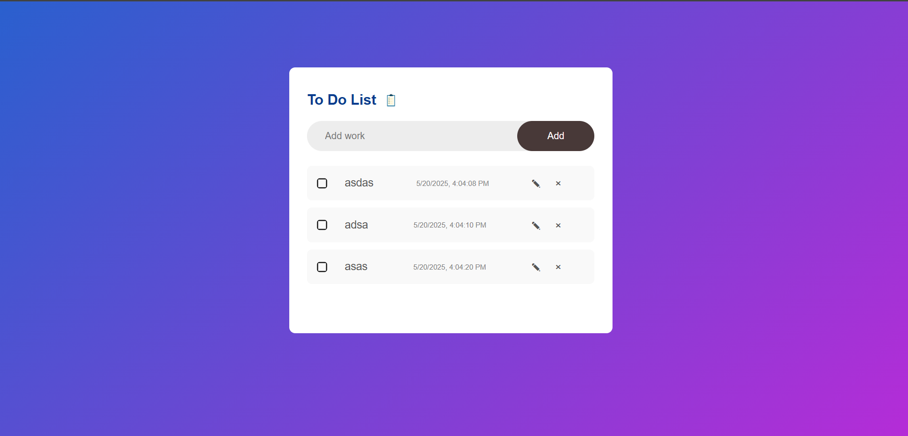

# 📝 To-Do List Web App

A simple and clean To-Do List web application built using **HTML**, **CSS**, and **JavaScript**. This app allows users to add, edit, mark, and delete tasks. It also saves tasks in the browser's `localStorage`, so they persist even after refreshing the page.

---

## Features

- Add new tasks  
- Edit existing tasks  
- Delete tasks  
- Mark tasks as complete/incomplete  
- Task creation timestamp  
- Persistent data using `localStorage`

---

## Demo

 


---

## Getting Started

### 1.Clone the repository

```bash
git clone https://github.com/Sandeep-lohoni/Todo-WebApp.git
cd Todo-WebApp
```

